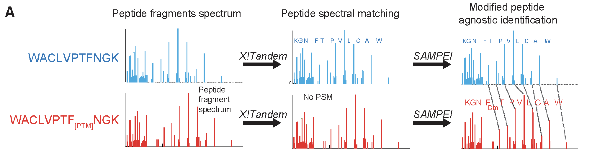

[](http://bioconda.github.io/recipes/sampei/README.html)

# SAMPEI


## Summary
Recent studies have revealed diverse amino acid, post-translational and non-canonical modifications of proteins in diverse organisms and tissues. However, their detection and analysis remain hindered by technical limitations. Here, we present a spectral alignment method for the identification of protein modifications using high-resolution mass spectrometry proteomics. Termed SAMPEI for Spectral Alignment-based Modified PEptide Identification, this open-source algorithm is designed for the discovery of functional protein and peptide signaling modifications, without prior knowledge of their identities. Using synthetic standards and controlled chemical labeling experiments, we demonstrate its high specificity and sensitivity for the discovery of sub-stoichiometric protein modifications in complex cellular extracts. SAMPEI mapping of mouse macrophage differentiation revealed diverse post-translational protein modifications, including distinct forms of cysteine itaconatylation. SAMPEI’s robust parameterization and versatility are expected to facilitate the discovery of biological modifications of diverse macromolecules.

Tandem mass spectrometry enables high-throughput peptide identifications in complex biological specimens. In conventional methods, peptide identification relies on database search which is limited by the identification of only small number of post translational modifications (less than 3). Such methods are unable to identify unanticipated PTMs. Here we developed SAMPEI, a computational method leveraging high resolution query spectra within the same or different dataset to assign target spectra with peptide sequence and unanticipated modifications (mass shift). Prior to SAMPEI, we utilized database search (X!tandem) to assign spectra with peptide sequences in each sample. Only spectra with unique modifications and with the highest peptide identification confidence (lowest e value) are selected as queries. SAMPEI then performs a series of orthogonal measures to evaluate the similarity between all unassigned spectra and query spectra within predefined mass difference window (default = +/- 200 Dalton). First, SAMPEI aligns discrete m/z ranges within unassigned spectra to the query spectra. The proportion of matched MS2 ion intensity from query over the total MS2 intensity defined as matched query intensity is used to pre-select candidate spectra. Then, two additional measures to assess the quality of the assignment against query peptide sequence are determined to evaluate the goodness of the match. Specifically, the proportion of the MS2 intensity of target spectrum matched to the theoretical m/z of the query peptide sequence over the total MS2 intensity in the target scan is one of the measures. Finally, the proportion of the largest consecutive b/y ions missing over the length of the peptide sequence defined as largest gap percentage is the last measure. These parameters can be adjusted to maximize sensitivity or specificity, as dictated by experimental needs.



Figure 1. Schematcis of SAMPEI. (A) Example spectra represent the naive and modified peptide where Dm denotes the potential modification at residue F. With database (DB) search, only defined modification is able to be identified (Top). When incorporating DB search with SAMPEI, high quality query spectra was leveraged to identify target spectra with high similarities through three measures, matched query intensity, matched peptide intensity and largest gap percentage

# Installation
SAMPEI can be installed using either pip or conda.

## Conda
1. If Anaconda is not installed, first install it by following instructions found here: https://docs.conda.io/en/latest/miniconda.html

2. Install the package using : `conda install -c bioconda sampei`

## Pip
1. Pip is generally installed with Python
2. Install the package using `pip install sampei`

# Usage
Once installed SAMPEI can be run using the `sampei` command in the terminal.

To ensure that the package has been installed and to view the command line arguments run:
```sampei --help```

This command will ouput the command line help if the package has been installed correctly.

### Running SAMPEI
Once sampei has been installed it can be run using the following command:
```bash
sampei <<query_mgf_file_path>> <<target_mgf_file_path>> <<id_file_path>> <<additional_flags>>
```

Three files are required for SAMPEI to run:
### Query/Target mgf files
A pair of mgf files is needed as input files with full path. One is used as query mgf file to perform conventional database search and provide high confidence query spectra. The other mgf file could be the same or different mgf file in which user want to uncover peptide with novel modifications not discovered by conventional search.
Please make sure mgf file formated as one of the following examples. Of note, if users use MS converter to generate mgf files, please install it with the “TPP compatibility” feature disabled.

Example 1:\
BEGIN IONS\
TITLE=Filename.390.390.3\
RTINSECONDS=303.016\
PEPMASS=442.230102539063 171650277.125\
CHARGE=3+\
129.1024323 379843.65625\
130.0500488 108622.1875\
136.0758667 226632.171875\
148.0606232 279413.0625\
173.0922699 26675.123046875\
END IONS

Example 2:\
BEGIN IONS\
TITLE=Scan 4, Time=1.181370, MS2, HCD\
PEPMASS=414.713379\
CHARGE=2\
120.438423	276.109863\
121.133255	185.422791\
122.366203	176.366150\
127.615936	226.262482\
127.961296	208.581024\
127.989967	221.123886\
END IONS

### ID file
A separate tab-delimited (tsv) file produced by X!tandem or other database search tools needs to be provided. SAMPEI is applicable to different database search tools, as long as id file contains the following columns with designated column names as listed below.

|Column name|Description|Example|
|-|-|-|
|scan|Scan id of the query scan (integer value)|1234|
|peptide|Peptide sequence identified by database search (string)|LPRSPPLKVLAE|
|modifications|Modification assigned to the sequence by database search (need to end with comma, and if multiple, separated by comma)|42.01057@A1,57.02147@C4,|
|charge|Charge state of the query scan|3|
|proteins|Protein names or accession number|sp_Q03052_PO3F1_HUMAN|
|Filename|Query mgf file name with no extension|KRG_MV411_G|
|expect|If using X!tandem in database search, otherwise optional|1.2e-08|
|total_MS2_intensity|If provided by X!tandem, otherwise optional|1659586.90743756|

### Example input files
Demo mgf and id files meet the package requirements can be download [here](https://github.com/FenyoLab/SAMPEI/blob/master/tests/demo_files.zip).

### Addiotional Flags

There are additional flags which can be set to fine tune the search parameters:
|Flag|Default|Description|
|-|-|-|
|--error-type|ppm||
|--fragment-mass-error|20||
|--largest-gap-percent|0.4||
|--matched-peptide-intensity|0.5|The ratio of MS2 intensity of target scan matched to the theoretical fragments of peptide sequence over the summation of total MS2 intensity in the target scan|
|--matched-query-intensity|0.3|The ratio of MS2 intensity of query scan matched to target scan over the summation of total MS2 intensity in the query scan|
|--max-peaks-per-scan|20|
|--min-diff-dalton-bin|10|The absolute minimum dalton difference between the query scan and the target scan|
|--no-filter|False|Do not remove DB identified scans in the target mgf file|
|--output-directory|output|The directory where output files will be created|
|--write-intermediate|False|If specified both the unfiltered and filtered results will be written to file|
|--xtandem-xml||An X!tandem xml file which will be used for filtering results|

# Output
Output File

The output produced by SAMPEI has columns listed below.

|Column name|Description|Example|
|-|-|-|
|MGF_query_file|Query mgf file name|190509_DL_OCIAML2_ACL_1.mgf|
|MGF_target_file|Target mgf file name|190509_DL_OCIAML2_ACL_1.mgf|
|Diff_dalton|Mass difference between query and target scan|71|
|Diff_dalton_bin|Integer mass difference between query and target scan|71.0378	71|
|Query_scan|Scan number of query spectra|49620|
|Query_scan_mz|Query scan m/z|759.7163086|
|Query_scan_charge|Query scan charge|3|
|Target_scan|Scan number of target spectra|33549|
|Target_scan_mz|Target scan m/z|783.3955688|
|Target_scan_charge	|Target scan charge|3|
|Matches|Normalized number of matches|0.55|
|Matched_query|The percentage of MS2 intensity of query scan matched to target scan over the summation of total MS2 intensity in the query scan|0.611027774|
|Matched_intensity_product|percent matched query intensity times percent matched target intensity|0.237107605|
|Sum_log_intensity|Sum of log transformed query and target MS2 intensities|11.7649257|
|Peptide|Peptide sequence of target scan|GPAIGIDLGTTYSCVGVFQHGK|
|Modifications|Query scan modification|57.02147@C14,|
|Expect (Optional)|E value by X!tandem|0.00066|
|Total_MS2_intensity (Optional)|Query scan total MS2 intensity|2398832.919|
|Proteins|Protein name or id|sp_P54652_HSP72_HUMAN|
|Matched_peptide_intensity_max|The percentage of MS2 intensity of target scan matched to the theoretical fragments of peptide sequence over the summation of total MS2 intensity in the target scan|0.823|
|Largest_gap|The largest consecutive b/y ion missing |5|
|Largest_gap_percent|Largest gap over the length of the peptide sequence|0.227272727|
|Full_mod|Target scan modification|57.02147@C14,71.0377807617@I6,|
|Unique_mod|Target scan modification identified uniquely by SAMPEI|71.0377807617@I6,|

# Citing SAMPEI
[Cifani P, Li Z, Luo D, Grivainis M, Intlekofer AM, Fenyö D, Kentsis A. Discovery of Protein Modifications Using Differential Tandem Mass Spectrometry Proteomics. J Proteome Res. 2021 Mar 22. doi: 10.1021/acs.jproteome.0c00638. Epub ahead of print. PMID: 33749263.](https://pubmed.ncbi.nlm.nih.gov/33749263/)
